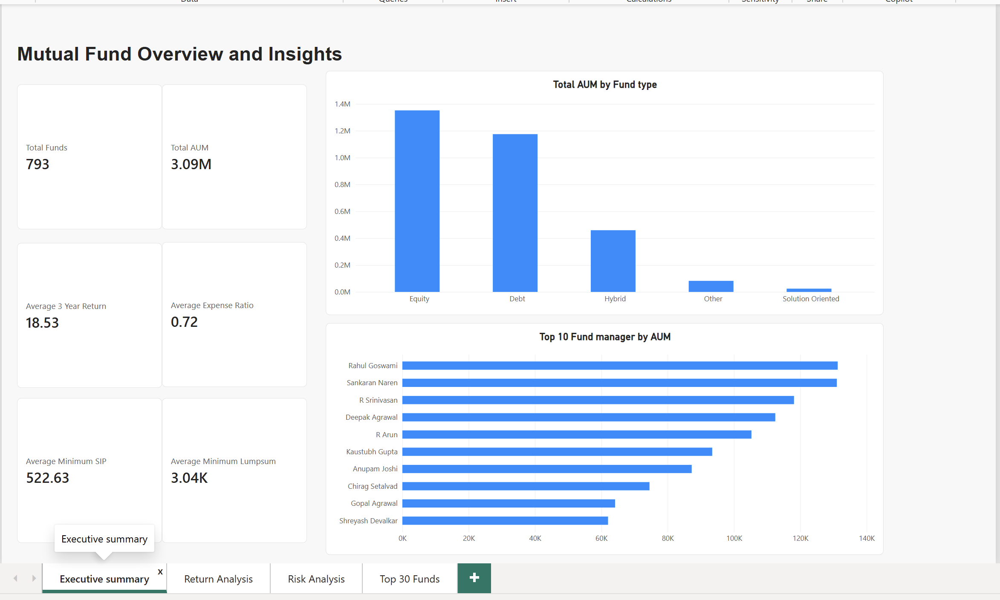
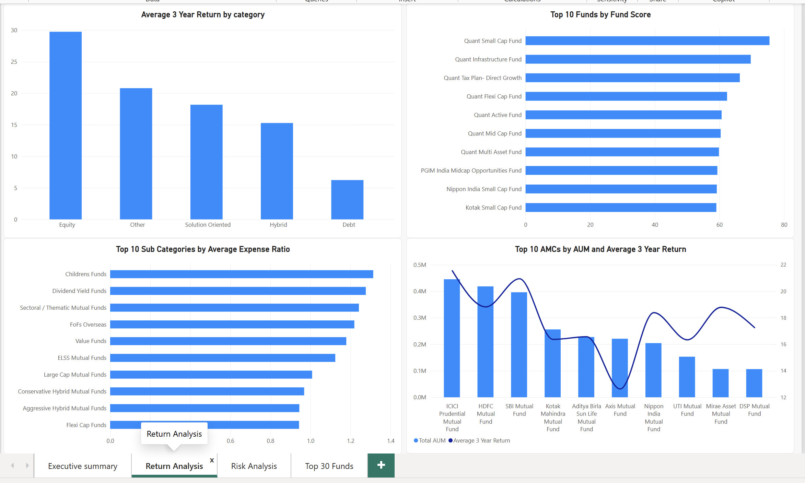
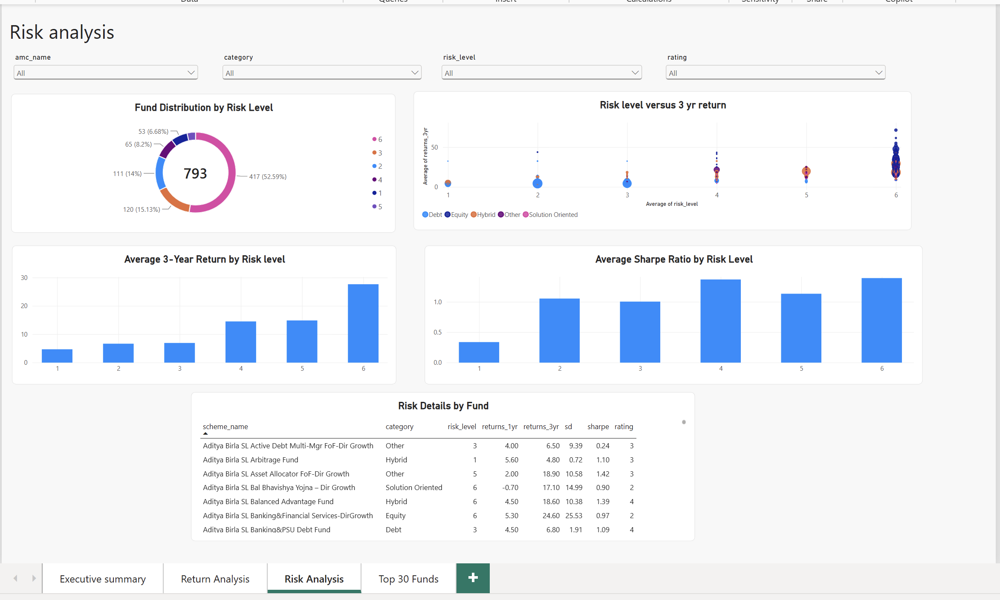
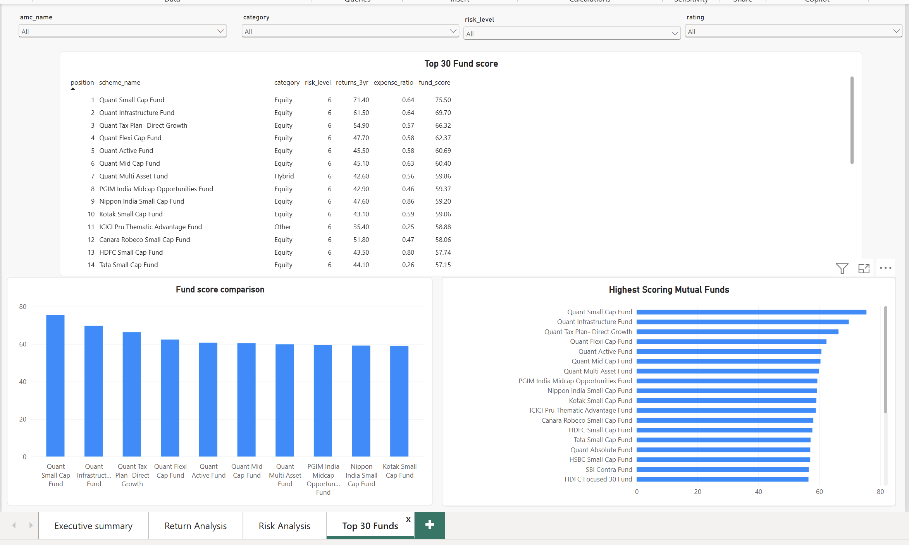

# Mutual Fund Overview & Insights

### Finding High-Return and Low-Cost Mutual Funds Through Data Analytics

An end-to-end data analytics project that cleans and explores mutual fund data, builds a transparent weighted scoring model, ranks schemes, exports the **Top 30 funds**, and presents the results through an interactive **Power BI dashboard**.

**Tools:** Python · Pandas · NumPy · Matplotlib · Seaborn · Scikit-learn · Excel · Power BI

> **Disclaimer:** This is an educational analytics project, not investment advice. Historical returns and model rankings do not guarantee future performance. The scoring formula does not directly include volatility or risk-adjusted returns; use the Risk Analysis dashboard alongside the ranking.

## Project objectives

- Clean and prepare mutual fund data for analysis.
- Explore fund performance across categories and asset management companies (AMCs).
- Examine expense ratios, risk levels, AUM, and historical returns.
- Create a reproducible weighted **Fund Score** and rank the available schemes.
- Export the **Top 30** ranked funds to Excel and communicate findings through Power BI.

## Dataset

The analysis uses mutual fund information including scheme name, AMC, category, sub-category, fund manager, one-, three-, and five-year returns, expense ratio, fund size/AUM, fund age, risk level, rating, and risk metrics such as standard deviation, Sharpe ratio, Sortino ratio, alpha, and beta.

The notebook expects an input CSV named `Mutualfund.csv`. Make sure you have permission to redistribute the original dataset before uploading it publicly.

## Workflow

### 1. Data cleaning

Using Python and Pandas, the notebook standardizes column names and text fields, converts financial and risk columns to numeric values, checks missing values and duplicates, removes duplicate rows, and fills missing risk metrics with their respective **category medians**. It also checks selected values for potential anomalies and exports a cleaned dataset.

### 2. Exploratory data analysis (EDA)

The notebook investigates:

- Total AUM by AMC and average three-year returns by category.
- Distribution of risk levels and expense ratios.
- Risk level versus three-year returns.
- Outliers in one-year returns.

Visualizations include bar charts, a risk-level count plot, box plots, a histogram, and a scatter plot.

### 3. Normalization and fund scoring

The four scoring variables are normalized using `MinMaxScaler`. Because a **lower expense ratio** is preferable in this model, its normalized value is inverted:

```python
expense_score = 1 - expense_ratio_scaled
```

The final weighted score is calculated as:

```text
Fund Score = 100 × (
    0.40 × normalized 3-year return
  + 0.30 × expense score
  + 0.20 × normalized fund age
  + 0.10 × normalized 1-year return
)
```

| Scoring factor | Weight |
|---|---:|
| 3-year return | 40% |
| Expense ratio (inverted) | 30% |
| Fund age | 20% |
| 1-year return | 10% |

Funds are sorted by descending score and assigned a `position`. The notebook also assigns project-specific score bands: **A** for scores ≥70, **B** for scores ≥50 and below 70, and **C** for scores below 50. These are internal model labels, not external credit or fund ratings.

### 4. Top 30 export

The highest-scoring 30 schemes are exported to `top_30_mutual_funds.xlsx`, including their ranks, score bands, fund details, returns, costs, risk levels, and ratings.

## Power BI dashboard

The dashboard has four pages:

| Page | What it shows |
|---|---|
| **Executive Summary** | Dataset-level KPIs, including fund count, AUM, average return, and average expense ratio. |
| **Return Analysis** | Return comparisons across fund categories and AMCs, expense ratios, and fund scores. |
| **Risk Analysis** | Risk distribution, risk versus return, average three-year return and Sharpe ratio by risk level, and fund-level details. |
| **Top 30 Funds** | Ranked Top 30 table, Fund Score ranking chart, and a focused score comparison. |

Interactive slicers support exploration by AMC, category, risk level, and rating.

## Sample ranking result

The project README records the following first three entries from the Top 30 Excel export (check against `data/top_30_mutual_funds.xlsx` if the dataset changes):

| Position | Scheme | Fund Score |
|---:|---|---:|
| 1 | Quant Small Cap Fund | 75.50 |
| 2 | Quant Infrastructure Fund | 69.70 |
| 3 | Quant Tax Plan- Direct Growth | 66.32 |

These results reflect the provided dataset and the selected scoring weights; they are not investment recommendations.

## Dashboard previews

The repository includes four screenshots of the Power BI dashboard:






## Repository contents

```text
Mutual-Fund-Analysis/
├── README.md
├── .gitignore
├── Screenshots/
│   ├── dashboard1.png
│   ├── dashboard2.png
│   ├── dashboard3.png
│   └── dashboard4.png
├── dashboards/
│   └── Mutual_Fund_Analysis_Dashboard_final.pbix
├── data/
│   └── top_30_mutual_funds.xlsx
└── python/
    └── mutualfund_pythonScript.ipynb
```

The original input CSV, `Mutualfund.csv`, is not currently included in the repository. The project report mentioned in an earlier draft is also not included.

## How to run

1. Clone or download this repository.
2. Install the required Python libraries:

   ```bash
   pip install pandas numpy matplotlib seaborn scikit-learn openpyxl jupyter
   ```

3. Obtain the original input dataset `Mutualfund.csv` from a source you are permitted to use. Open `python/mutualfund_pythonScript.ipynb` in Jupyter Notebook or VS Code, and adjust its dataset path to where you saved the CSV.
4. Run the notebook cells in order. **Note:** An intermediate cell reads `cleaned_dataset.csv`, while an earlier export uses `cleaned_mutual_funds_data.csv`. Update the input filename in that cell (or rename the exported file) before running the entire notebook.
5. Review the generated CSV files and `top_30_mutual_funds.xlsx`.
6. Open `dashboards/Mutual_Fund_Analysis_Dashboard_final.pbix` in Power BI Desktop to explore the dashboard. If the dataset is stored at a different location, update the data source path and refresh the report.

## Limitations

- Fund scores depend on the dataset, normalization range, and subjective weights.
- The score favors historical returns, lower fees, and fund age; it does **not** directly penalize volatility or incorporate Sharpe ratio.
- Missing-value treatment and data quality can affect comparisons.
- Past performance is not a reliable predictor of future returns.

## Author

**Srivalli Korada**  
B.Tech — Computer Science and Information Technology  
Data Analytics & Data Science
